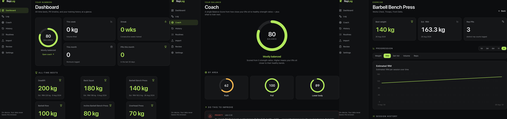
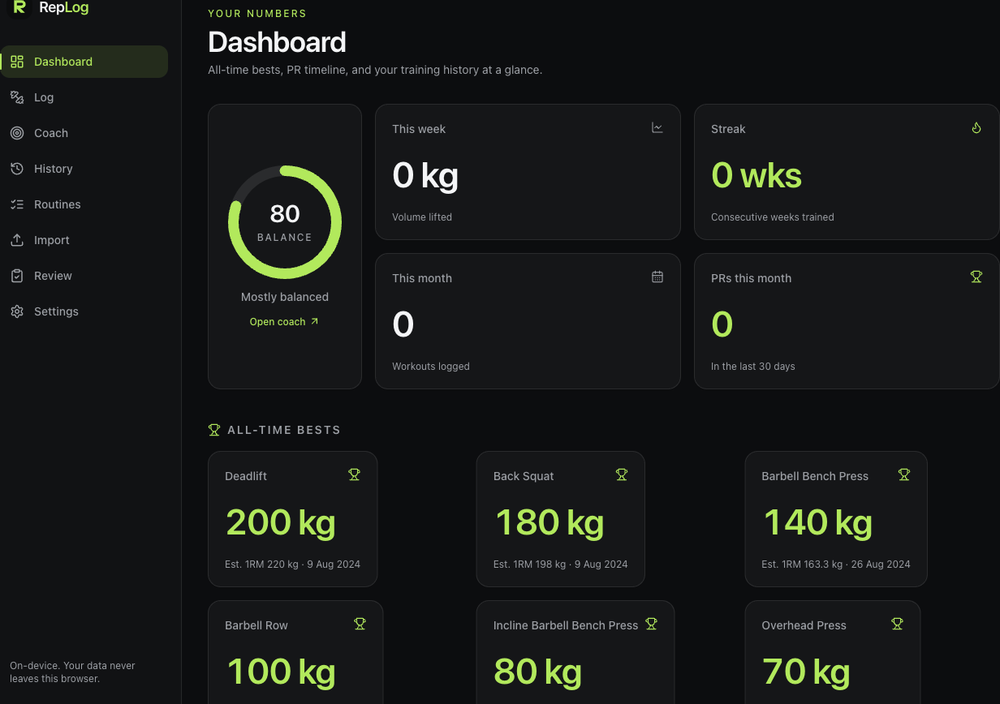
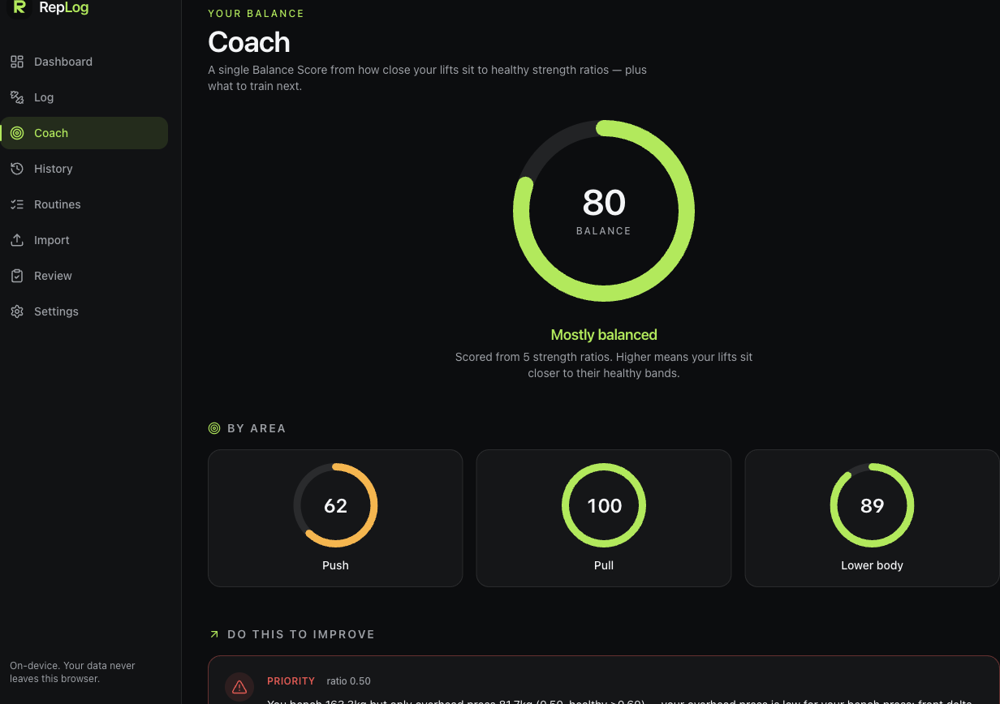
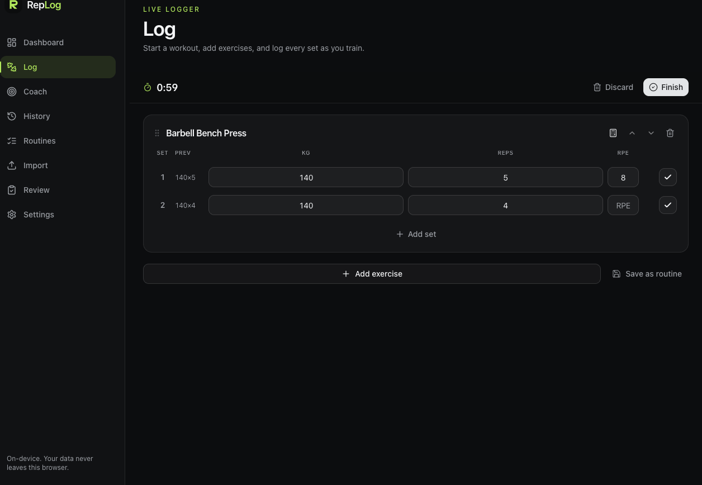
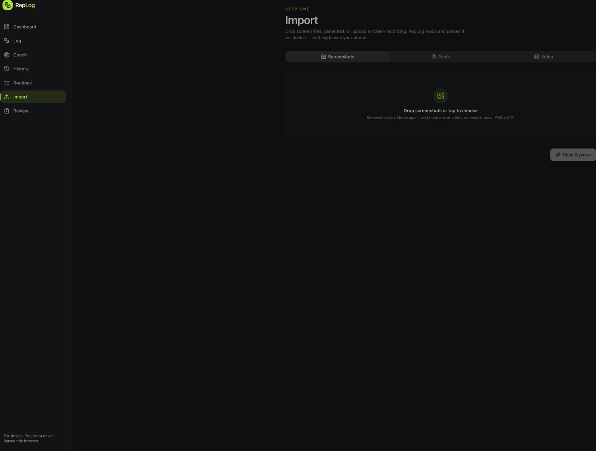
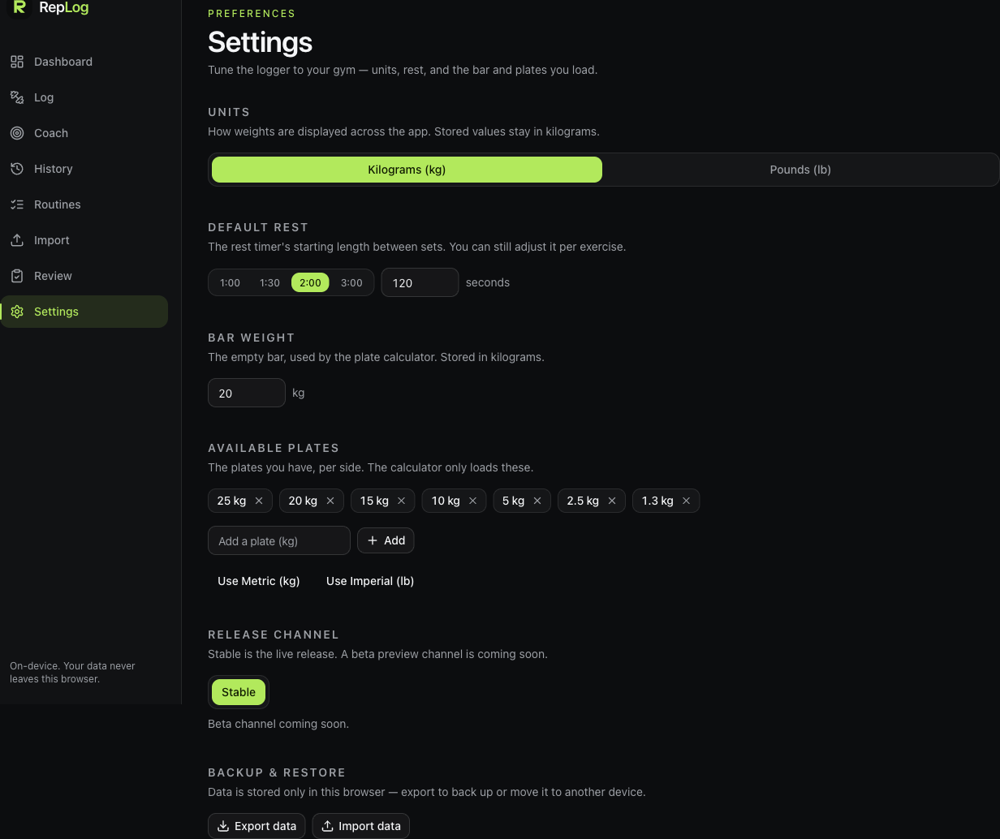
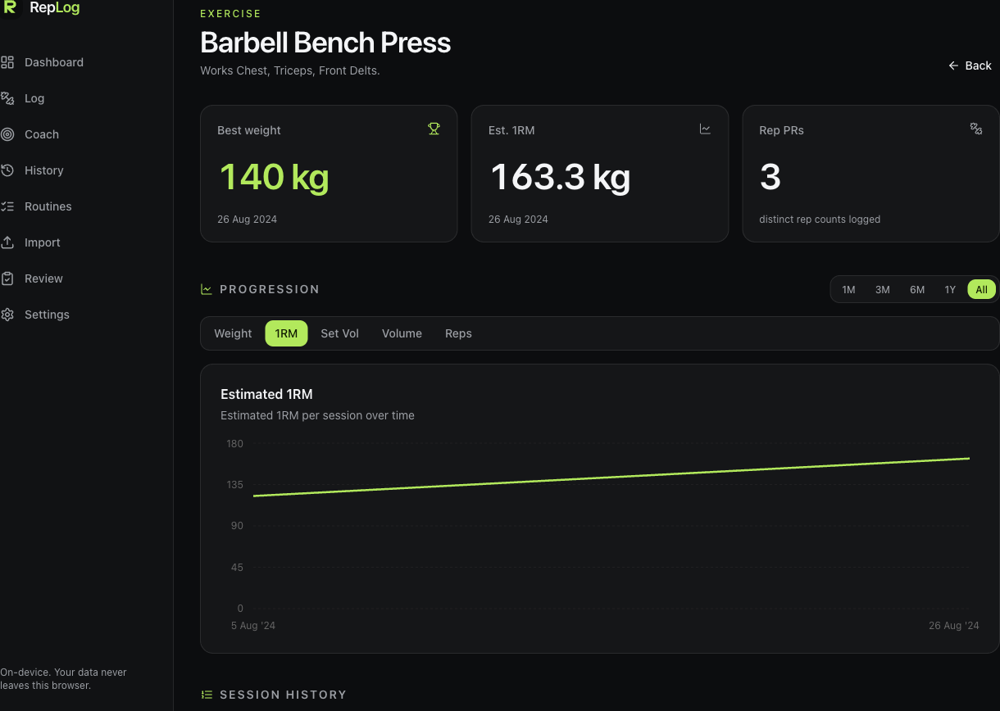

<a id="readme-top"></a>

<div align="center">

  <a href="https://benasbarciauskas.github.io/RepLog/">
    
  </a>

  <h1>RepLog</h1>

  <p>
    <strong>Turn your old workout notes into a coach — then log every set live.</strong>
    <br />
    Private, offline-first strength tracking — import, log, coach, and program your training, all in your browser. No account, no server; on-device by default.
  </p>

  <p>
    <a href="https://benasbarciauskas.github.io/RepLog/"><strong>Open the app »</strong></a>
    &nbsp;·&nbsp;
    <a href="#-getting-started">Install as a PWA</a>
    &nbsp;·&nbsp;
    <a href="../../issues/new?labels=bug">Report a bug</a>
    &nbsp;·&nbsp;
    <a href="../../issues/new?labels=enhancement">Request a feature</a>
  </p>

  <p>
    <a href="LICENSE"></a>
    <a href="https://benasbarciauskas.github.io/RepLog/"></a>
    
    
    
    
    <a href="../../pulls"></a>
    <a href="../../stargazers"></a>
  </p>

  <a href="https://benasbarciauskas.github.io/RepLog/">
    
  </a>

</div>

<br />

> [!NOTE]
> **On-device by default.** No account, no sign-up, no cloud — your data lives in your browser (IndexedDB) and works fully offline once installed. The one optional exception is **AI parse**: if you choose to add your own free API key, the note text you ask it to parse is sent to that provider — nothing else, and only when you use it.

## ✨ What is RepLog?

RepLog is a workout tracker that does two things really well:

1. **Imports the workout notes you already have** — screenshots, pasted text, even a screen-recording of your notes app — reads them with on-device OCR, cleans up the mess, and turns years of scattered logs into a structured training history.
2. **Logs your workouts live** — start a session, search an exercise, and record set-by-set with previous-session hints, an auto rest timer, a plate calculator, and reusable routines.

On top of that history it builds **progress charts**, a **trends** view (PR timeline + training-block comparison), a **strength coach** that scores how balanced your lifts are, and a **program engine** that generates a research-based weekly plan and auto-progresses it from what you lift.

It is 100% client-side: a React + TypeScript app that runs in your browser, stores data on your device, and installs as a Progressive Web App on your phone or laptop. Free and open source.

## 🚀 Features

- 📸 **Import notes three ways** — upload screenshots, paste plain text, or drop in a phone screen-recording. In-browser OCR extracts the text; a relevance filter automatically keeps the workout notes and drops everything unrelated.
- 🧹 **Smart messy-notes parser** — normalizes inconsistent exercise names and pulls out dates, bodyweight, the training split, and every set's reps and weight. A review step lets you confirm or fix anything before it's saved.
- 🏋️ **Live workout logger** — start or resume a session, search exercises, and log set-by-set with previous-session hints, warm-up sets, RPE, an automatic rest timer, and a built-in plate calculator.
- 🔁 **Routines & templates** — save reusable routines and load them in one tap, then finish to commit the session to history.
- 📈 **Progress that means something** — all-time bests, estimated 1RM, and per-exercise progression graphs with metric toggles (heaviest weight, est. 1RM, volume, reps) and selectable time ranges.
- 🗂️ **Full history** — per-session set history, bodyweight trend, training-block and split history, and a complete workout log.
- 🧠 **Strength coach** — a 0–100 strength-balance score with per-area ring gauges, plus recommendation cards that flag underdeveloped muscles by comparing your lifts against established strength-ratio standards (e.g. overhead press vs. bench, squat vs. bench).
- 📊 **Weekly volume insights** — sets per muscle over the last week vs. evidence-based MEV/MAV ranges, with "add N sets here" recommendations.
- 🗓️ **Program engine** — generate a weekly plan from your goal, experience, days/week, split, session length, and recovery (sleep/stress). It picks exercises by muscle, sets rep ranges + RIR, **auto-progresses** with double progression + daily undulating periodization, and lets you **swap** any lift for a similar one.
- 📅 **Trends** — a PR timeline (every weight + est-1RM record, newest first) and side-by-side **training-block comparison**.
- 💾 **Backup & restore** — export all your data to a JSON file and import it on another device.
- 🤖 **Optional AI parse** — for messy notes the built-in parser can't crack, bring your own free OpenRouter key (stored on your device) to extract workouts with an LLM. Fully opt-in; the deterministic parser stays the default.
- 📱 **Web + native** — an installable PWA (offline on iOS/Android/desktop) plus a native **Expo app** in [`mobile/`](mobile/) sharing the same engine.
- 🔒 **Private by default** — no account, no sign-up, no backend. Everything runs and stays on your device; the only optional network feature is AI parse, with your own key.

## 📸 Screenshots

<div align="center">

|                         Dashboard                          |                          Coach                           |
| :--------------------------------------------------------: | :------------------------------------------------------: |
|  |  |

|                       Live logger                        |                         Import                          |
| :------------------------------------------------------: | :----------------------------------------------------: |
|  |  |

|                          Settings                          |                  Per-exercise progress                   |
| :--------------------------------------------------------: | :------------------------------------------------------: |
|  |  |

</div>

## 💡 Why & how it works

Most people already have a training history — it's just trapped in notes apps, photos, and spreadsheets in a hundred different formats. RepLog's whole premise is that **your past data is the most valuable input a tracker can have**, so it meets you where that data already lives.

**Import → parse → review → save.** You hand RepLog a screenshot, some pasted text, or a screen-recording of your notes. It runs OCR in your browser, filters out anything that isn't a workout, and parses the rest into structured sessions — normalizing exercise names and extracting dates, bodyweight, splits, and sets/reps/weight. You get a review screen to fix anything before it's committed.

**Log live, learn over time.** Going forward you log workouts set-by-set in the app. Each new entry feeds the progress charts and the coach, so the picture of your training keeps sharpening with every session.

**Coach by the numbers.** The coach compares your key lifts against well-established strength-ratio standards and surfaces where you're out of balance — turning raw logs into a clear "here's what to work on" without any guesswork or guru opinions.

**Program your training.** Beyond tracking, RepLog builds a weekly program from a few inputs — using research-based volume landmarks (MEV/MAV), goal-appropriate rep ranges, and your recovery (sleep/stress) — then progresses it automatically from what you actually lift, and swaps exercises on request. Optionally refine the plan with your own AI key.

### 🔐 Private, offline, on-device

This is the part that matters most, so it's worth being explicit:

- **On-device by default.** OCR, parsing, charts, the coach, trends, and the program engine all run on-device — there's no backend to send your data to. The sole exception is the optional **AI parse**, which only runs when you enable it with your own key.
- **No account, no sign-up.** Open the app and start. The built-in parser, logger, coach, trends, and program engine need no key; AI parse is the one opt-in that does.
- **Local storage.** All your workouts live in your browser's IndexedDB. Clearing site data or uninstalling removes them; nothing lingers on a server.
- **Works offline.** Once installed as a PWA, RepLog loads and functions without a connection.

<p align="right">(<a href="#readme-top">back to top</a>)</p>

## 🏁 Getting started

### Option 1 — Use the hosted app (recommended)

Open **[https://benasbarciauskas.github.io/RepLog/](https://benasbarciauskas.github.io/RepLog/)** in any modern browser. That's it — no install required to start logging.

**Install it as a PWA** so it works offline and lives on your home screen / dock:

- **iPhone / iPad (Safari):** tap **Share** → **Add to Home Screen**.
- **Android (Chrome):** tap the **⋮** menu → **Install app** / **Add to Home screen**.
- **Desktop (Chrome / Edge):** click the **install icon** in the address bar, or the **⋮** menu → **Install RepLog**.

### Option 2 — Run from source

**Prerequisites:** [Node.js](https://nodejs.org/) ≥ 20

```bash
git clone https://github.com/benasbarciauskas/RepLog.git
cd RepLog
npm install
npm run dev          # open http://localhost:5173
```

### Option 3 — Build & self-host

RepLog compiles to a folder of static files — host it on any static host or your own server, no backend required.

```bash
npm run build        # outputs static assets to /dist
npm run preview      # optional: preview the production build locally
```

Then deploy the contents of `/dist` to any static host (object storage + CDN, a static-site host, GitHub Pages, or a plain web server). Because there's no server-side component, there's nothing else to provision.

### Option 4 — Native app (Expo)

A native iOS/Android build lives in [`mobile/`](mobile/) — Expo + expo-router, sharing this repo's parser, analytics, and coach logic, with on-device `expo-sqlite` storage.

```bash
cd mobile
npm install
npx expo start        # scan the QR code with Expo Go on your phone
```

See **[TUTORIAL.md → Native app via Expo](TUTORIAL.md)** for the Expo Go workflow and building/submitting a real binary with EAS (expo.dev).

<p align="right">(<a href="#readme-top">back to top</a>)</p>

## 🧰 Tech stack

| Layer            | Tools                                                            |
| ---------------- | --------------------------------------------------------------- |
| UI               | [React 19](https://react.dev/), [TypeScript](https://www.typescriptlang.org/) |
| Build            | [Vite 7](https://vitejs.dev/), [vite-plugin-pwa](https://vite-pwa-org.netlify.app/) |
| Styling          | [Tailwind CSS v4](https://tailwindcss.com/), [shadcn/ui](https://ui.shadcn.com/) |
| Charts           | [Recharts](https://recharts.org/)                              |
| Local data       | [Dexie](https://dexie.org/) over IndexedDB (web), [expo-sqlite](https://docs.expo.dev/versions/latest/sdk/sqlite/) (native) |
| OCR              | [Tesseract.js](https://tesseract.projectnaptha.com/)           |
| Native app       | [Expo](https://expo.dev/) + [expo-router](https://docs.expo.dev/router/introduction/), [NativeWind](https://www.nativewind.dev/) |
| Delivery         | Installable PWA (static site) + native iOS/Android via Expo     |

Everything runs client-side. The OCR engine, the parser, the charts, and the coach all execute in the browser.

<p align="right">(<a href="#readme-top">back to top</a>)</p>

## 🗺️ Roadmap

- [x] **Native mobile app** (Expo / React Native) — core screens shipped in [`mobile/`](mobile/), reusing the same on-device import, parsing, and coaching logic
- [x] Local **export / import** (JSON) for moving data between devices — on web and mobile; encrypted sync is next
- [ ] Optional cross-device sync (end-to-end encrypted)
- [ ] More import formats and smarter exercise-name normalization
- [x] **Program engine** — research-based generator + auto-progression (double progression / DUP) + exercise swap + goal-based weekly volume insights (MEV/MAV)
- [x] **Trends** — PR timelines + per-block comparisons
- [ ] Additional coach strength-ratio standards

See the [open issues](../../issues) for the current backlog and to suggest something new.

<p align="right">(<a href="#readme-top">back to top</a>)</p>

## 🤝 Contributing

Contributions are very welcome — bug reports, feature ideas, and pull requests all help.

1. Fork the repo and create a branch: `git checkout -b feat/your-idea`
2. Make your change and run the app locally (`npm run dev`)
3. Commit and open a pull request describing what and why

Browse the [open issues](../../issues) for good places to start, and see [CONTRIBUTING.md](CONTRIBUTING.md) for the workflow and conventions.

<p align="right">(<a href="#readme-top">back to top</a>)</p>

## 📄 License

Distributed under the MIT License. See [`LICENSE`](LICENSE) for details.

<p align="right">(<a href="#readme-top">back to top</a>)</p>
